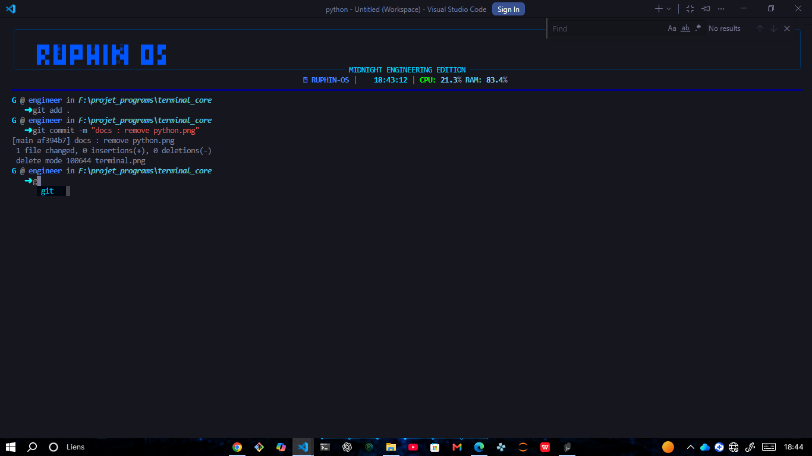

# RUPHIN-OS

**RUPHINOS** est un terminal construis entièrement en python ,de base c'était un simple test mais avec le temps il est devenu utile car il permet de comprendre comment marche les terminaux comme powershell,git,bash et cerstains langaguages comme le shell,bash ...

## Aperçue



## ✨ Fonctionnalités

- Autocomplétion
- mini-mémoire
- commandes personnalisées
- Mémoire RAM & CPU

## Installation

```bash
git clone https://github.com/votre-utilisateur/RUPHINOS.git

cd RUPHINOS

pip install -r requirements.txt

python os.py
```

ou si vous preferez vous pouvez le transformer en app executable c'est plus pratique,

```bash
pyinstaller --noconsole --onefile --windowed --icon=yourimage.ico --name="your name" os.py
```
